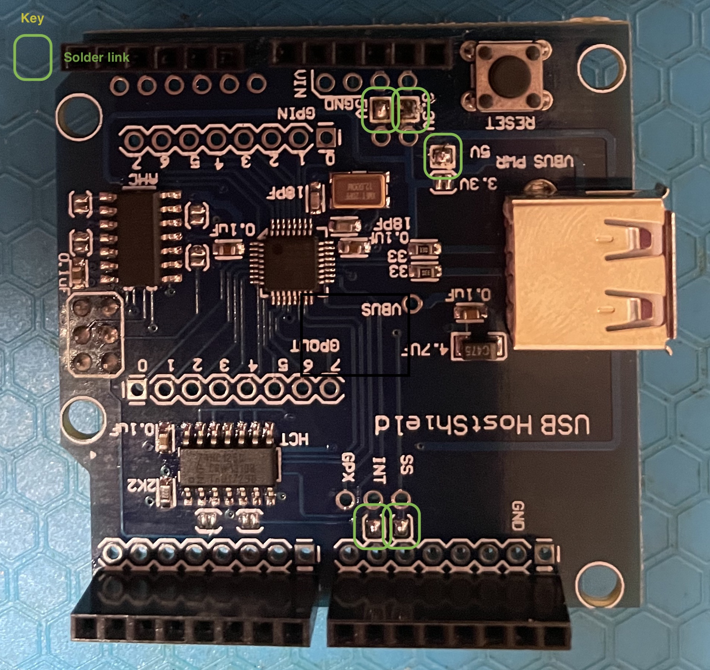

# Investigations of USB Host Shields on the Arduino Platform

## Intent 

To define the capabilities of USB host boards with a view to 
developing applications for retrocomputing and data acquisition.

The first application will be to provide a USB keyboard interface
to an Apple II+ bare board purchased on eBay.

## Scope

The Arduino USB host shields under consideration include: 
1. a ubiquitous design available from many sources originating from Circuits at Home. In my case this was purchased from Jaycar, Melbourne, Australia.
1. a board designed by and sourced from Sparkfun.
1. a board designed to support the Android SDK, an IOIO shield.

### Circuits at Home

To enable 5V operation the links annotated in green were soldered. 
The SS and INT links may not need to be bridged if a copper trace is already present.

### Sparkfun

