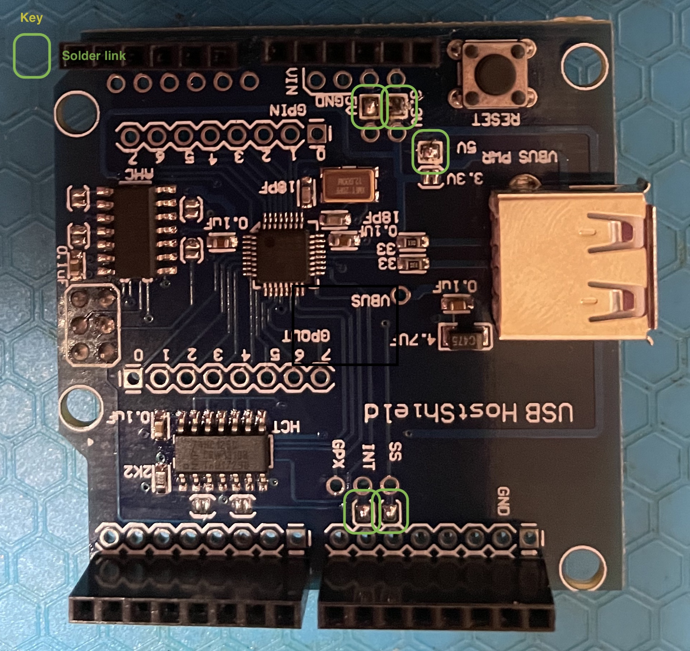
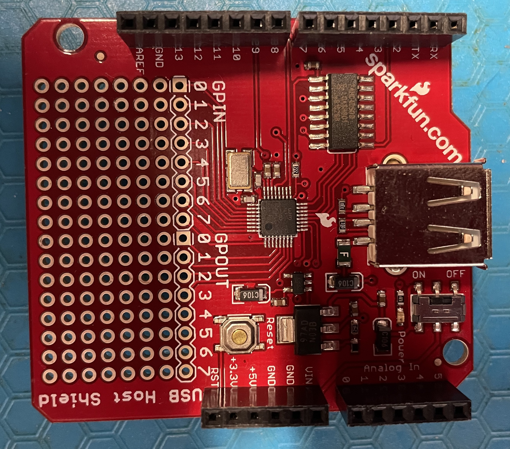

= Investigations of USB Host Shields on the Arduino Platform

== Intent 

To define the capabilities of USB host boards with a view to 
developing applications for retrocomputing and data acquisition.

The first application will be tp provide a USB keyboard interface
to an Apple II+ bare board purchased on e3Bay.

== Scope

The Arduino USB host shields under consideration include: 
1. a ubiquitous design available from many sources originating from Circuits at Home. In my case this was purchased from Jaycar, Melbourne, Australia.
1. a board desgined and sourced by Sparkfun.
1. a board developed to support the Android SDK.

=== Circuits at Home

=== Sparkfun

