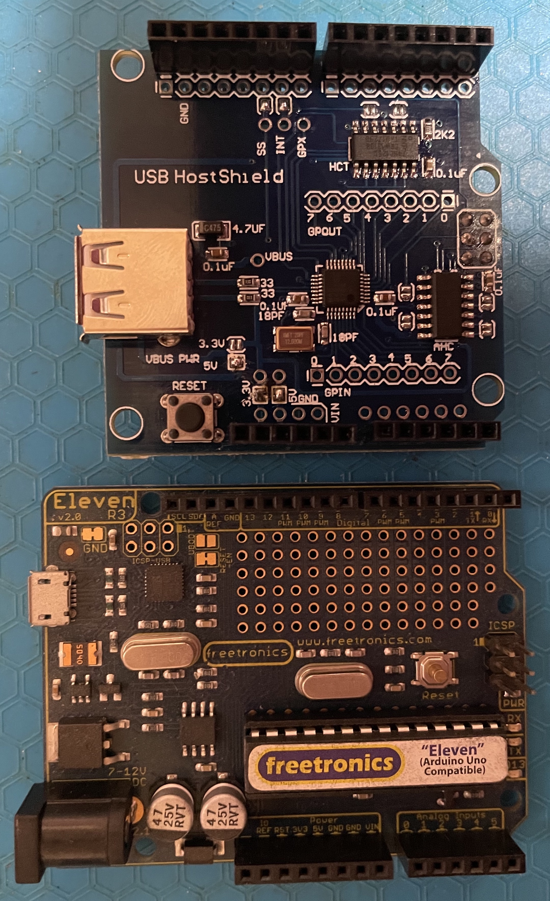

# Circuits at Home USB Host Shield

## Intent 

To define the capabilities of the Circuits at Home USB host shield with a view to 
developing applications for retrocomputing and data acquisition.

## Preparation

### Hardware 

A Arduino board (a Uno clone) and a USB host shield are purchased.

A Duemilanove board was tried intially, but this proved to be faulty.

The original user manual for this shield can be found [here...](https://chome.nerpa.tech/usb-host-shield-hardware-manual/)

To enable 5V operation the links annotated in green were soldered. 
The SS and INT links may not need to be bridged if a copper trace is already present.

To prepare for the test wire links aare soldered, to join the input and output ports of the Maxim USB host chip. 
A random USB device is also plugged into the USB socket. In this case a Bluetooth dongle is used.

### Software

Coding is run from the Arduino IDE. The IDE is used to select and download the *USB Host Shield Library 2.0*
via the §Sketch>Include Library>Manage Libraries... menu option. The actions are shiown below.

#### Menu Selection

#### Dialog Box

